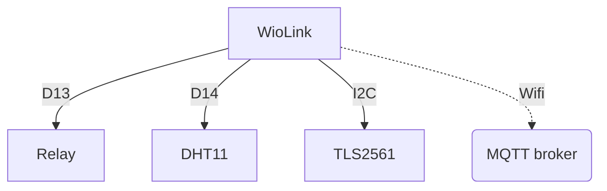

# WioGreenhouse

A WioLink ESP8266 project to monitor and control a small greenhouse.
Copyright 2024 Diego Quesada

## Features
- Controls grow lights via SPDT relay
- Measures temp, humidity and lux inside greenhouse
- Logs light, temp and humidity to MQTT broker

## Required connections

## Dependencies
Arduino core for the ESP8266 chip: https://github.com/esp8266/Arduino
Grove Temp and Humidity sensor v2.0.2: https://github.com/Seeed-Studio/Grove_Temperature_And_Humidity_Sensor
Arduino client for MQTT 2.8: https://github.com/knolleary/pubsubclient
Grove Digital Light Sensor v1.0.0: https://github.com/Seeed-Studio/Grove_Digital_Light_Sensor
NTPCilent v3.2.1: https://github.com/arduino-libraries/NTPClient

## Future improvements
- Use mDNS/DNS-SD to obtain MQTT server address
- Replace the DHT11 temp/humidity sensor with BME680
- Capture critical exceptions into flash for later analysis
- Add REST APIs to return sensor values
- Add REST APIs to set parameters such as time on/off
- Have web server provide a simple UI to access API and settings
- Log sensor values to an Azure or AWS MQTT endpoint instead of local Mosquitto
- Network provisioning using an adhoc access point
- Refactor code into multiple files
- Implement basic HomeKit support

## References
https://github.com/me-no-dev/EspExceptionDecoder
