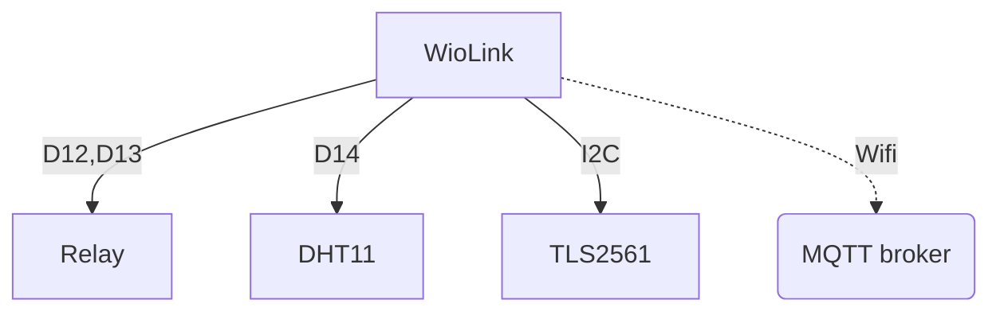

# WioGreenhouse

A WioLink ESP8266 project to monitor and control a small greenhouse.
Copyright 2024 Diego Quesada

## Features
- Controls grow lights via SPDT relay
- Measures temp, humidity and lux inside greenhouse
- Logs light, temp and humidity to MQTT broker

## Required connections

```mermaid
graph TD;
   A[WioLink] --> |D12,D13| B[Relay]
   A --> |D14| C[DHT11]
   A --> |I2C| D[TLS2561]
   A -.-> |Wifi| E(MQTT broker)
```

## Dependencies
Arduino core for the ESP8266 chip: https://github.com/esp8266/Arduino
Grove Temp and Humidity sensor v2.0.2: https://github.com/Seeed-Studio/Grove_Temperature_And_Humidity_Sensor
Arduino client for MQTT 2.8: https://github.com/knolleary/pubsubclient
Adafruit TSL2561 sensor v1.1.2: https://github.com/adafruit/Adafruit_TSL2561
NTPClient v3.2.1: https://github.com/arduino-libraries/NTPClient
PubSubClient v2.8.0: http://pubsubclient.knolleary.net/
ArduinoJson v7.3.0: https://github.com/bblanchon/ArduinoJson

## Device configuration
The device subscribes to the `wioLink/device_id/config` topic to update its configuration. The topic has the following format:

```
{
   "relays": [
      {
         "on": "time",        // time: turn on at specific time; always_on: keep on all the time
         "time_on": 6,        // if configured with "time", then turn on at this hour (24-hour clock)
         "time_off": 20       // if configured with "time", then turn off at this hour (24-hour clock)
      },
   ],
   "powerSaving": true,       // boolean value
   "deviceName": "upstairs"   // currently unused
}

## Fan control
The ESP8266EX datasheet indicates a maximum of 12 mA per GPIO. The fan requires up to 157 mA. Therefore we need to power it separately, and use
a transistor to control it.

## Future improvements
- Replace the DHT11 temp/humidity sensor with BME680
- Capture critical exceptions into flash for later analysis
- Add REST APIs to set parameters such as time on/off
- Have web server provide a simple UI to access API and settings
- Log sensor values to an Azure or AWS MQTT endpoint instead of local Mosquitto
- Network provisioning using an adhoc access point
- Implement basic HomeKit support

## References
https://github.com/me-no-dev/EspExceptionDecoder
