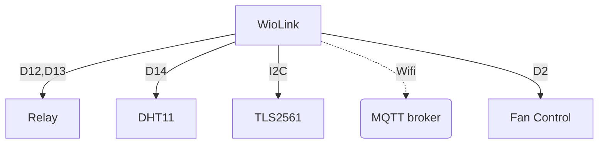
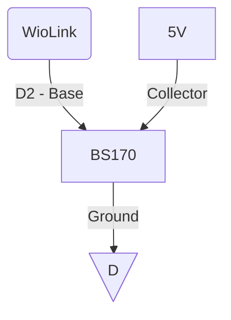

# WioGreenhouse

A WioLink ESP8266 project to monitor and control a small greenhouse.
Copyright 2024 Diego Quesada

## Features
- Controls grow lights via SPDT relay
- Measures temp, humidity and lux inside greenhouse
- Logs light, temp and humidity to MQTT broker
- Humidity-driven circulation fan

## Required connections

```mermaid
graph TD;
   A[WioLink] --> |D12,D13| B[Relay]
   A --> |D14| C[DHT11]
   A --> |I2C| D[TLS2561]
   A -.-> |Wifi| E(MQTT broker)
   A --> |D2| F[Fan Control]
```

## Library dependencies
* Arduino core for the ESP8266 chip: https://github.com/esp8266/Arduino
* Grove Temp and Humidity sensor v2.0.2: https://github.com/Seeed-Studio/Grove_Temperature_And_Humidity_Sensor
* Arduino client for MQTT 2.8: https://github.com/knolleary/pubsubclient
* Adafruit TSL2561 sensor v1.1.2: https://github.com/adafruit/Adafruit_TSL2561
* NTPClient v3.2.1: https://github.com/arduino-libraries/NTPClient
* PubSubClient v2.8.0: http://pubsubclient.knolleary.net/
* ArduinoJson v7.3.0: https://github.com/bblanchon/ArduinoJson

## Device configuration
The device subscribes to the `wioLink/device_id/config` topic to update its configuration. The topic has the following format:

```
{
   "relays": [
      {
         "on": "time",        // time: turn on at specific time; always: keep on all the time
         "timeOn": 6,        // if configured with "time", then turn on at this hour (24-hour clock)
         "timeOff": 20       // if configured with "time", then turn off at this hour (24-hour clock)
      },
   ],
   "fan": {
      "state": "on" | "off",  // Override the fan for two minutes
      "humidity": 70,         // Humidity level that triggers the fan
   },
   "powerSaving": true,       // boolean value
   "deviceName": "upstairs"   // user-friendly name
}
```

# REST APIs
The device runs a mini web server that supports the following APIs:
- /status: returns device current status
- /date: returns the device's current date
- /time: returns the device's current time
- /setRelay(relayIndex = #, on = yes|no, delay = #): sets a relay on|off, either permanently (delay=0), or for a specified number of seconds
- /sensors: returns the most recent values of all sensors

## Power consumption
Component | Draw
--- | ---
WioLink (Wi-Fi on)|70 mA
Relay module|89.3 mA
DHT11 module (when measuring)|2.1 mA
TLS2561 module|0.6 mA
TOTAL main device|162 mA
Fan (on)|157 mA
TOTAL system|319 mA
 
The ESP8266EX can provide max 12 mA per GPIO. The fan requires up to 157 mA and therefore
needs to be powered separately through an auxiliary board.


```mermaid
graph TD;
   A(WioLink) --> |D2 - Base| B
   B[BS170] --> |Ground| D@{shape: flipped-triangle}
   C[5V] --> |Collector| B
```

## Future improvements
- Replace the DHT11 temp/humidity sensor with BME680
- Capture critical exceptions into flash for later analysis
- Add REST APIs to set parameters such as time on/off
- Have web server provide a simple UI to access API and settings
- Log sensor values to an Azure or AWS MQTT endpoint instead of local Mosquitto
- Network provisioning using an adhoc access point
- Implement basic HomeKit support

## References
https://github.com/me-no-dev/EspExceptionDecoder
